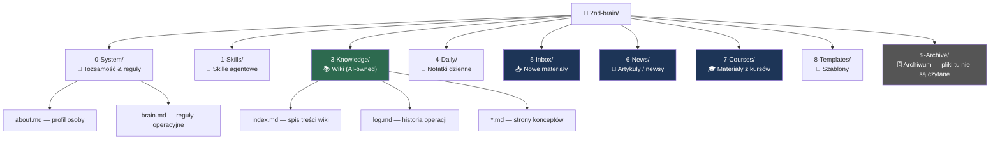
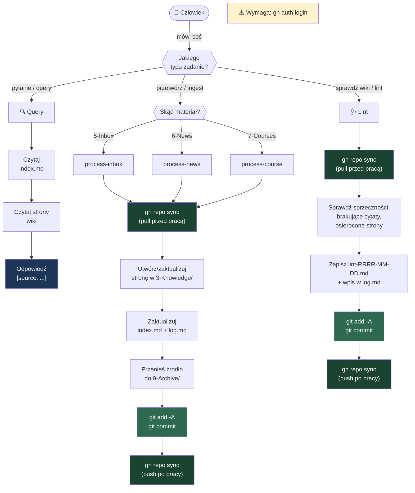
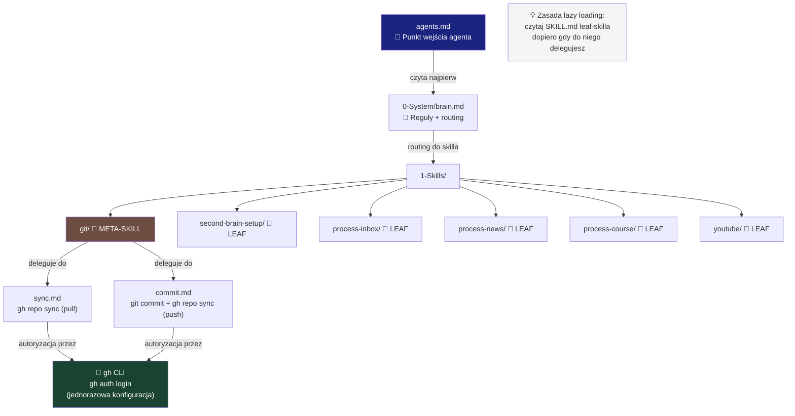

# Architektura Meta-Second-Brain — Diagramy

## Diagram 1 — Architektura folderów (właścicielstwo)

```mermaid
graph TD
    Brain["🧠 2nd-brain/"]

    Brain --> S0["0-System/\n📌 Tożsamość & reguły"]
    Brain --> S1["1-Skills/\n🔧 Skille agentowe"]
    Brain --> S3["3-Knowledge/\n📚 Wiki (AI-owned)"]
    Brain --> S4["4-Daily/\n📓 Notatki dzienne"]
    Brain --> S5["5-Inbox/\n📥 Nowe materiały"]
    Brain --> S6["6-News/\n📰 Artykuły / newsy"]
    Brain --> S7["7-Courses/\n🎓 Materiały z kursów"]
    Brain --> S8["8-Templates/\n📄 Szablony"]
    Brain --> S9["9-Archive/\n🗄️ Archiwum — pliki tu nie są czytane"]

    S0 --> about["about.md — profil osoby"]
    S0 --> brainmd["brain.md — reguły operacyjne"]

    S3 --> idx["index.md — spis treści wiki"]
    S3 --> log["log.md — historia operacji"]
    S3 --> pages["*.md — strony konceptów"]

    style S3 fill:#2d6a4f,color:#fff
    style S5 fill:#1d3557,color:#fff
    style S6 fill:#1d3557,color:#fff
    style S7 fill:#1d3557,color:#fff
    style S9 fill:#555,color:#fff
```

---

## Diagram 2 — Flow czterech operacji

```mermaid
flowchart TD
    Human(["👤 Człowiek"])

    Human -->|"mówi coś"| Router{{"Jakiego\ntypu żądanie?"}}

    Router -->|"pytanie / query"| Q["🔍 Query"]
    Router -->|"przetwórz / ingest"| TypeCheck{{"Skąd materiał?"}}
    Router -->|"sprawdź wiki / lint"| L["🩺 Lint"]

    TypeCheck -->|"5-Inbox"| PI["process-inbox"]
    TypeCheck -->|"6-News"| PN["process-news"]
    TypeCheck -->|"7-Courses"| PC["process-course"]

    Q --> ReadIdx["Czytaj\nindex.md"]
    ReadIdx --> ReadPages["Czytaj strony\nwiki"]
    ReadPages --> Answer["Odpowiedź\n[source: ...]"]

    PI & PN & PC --> GhSync["gh repo sync\n(pull przed pracą)"]
    GhSync --> ProcessFile["Utwórz/zaktualizuj\nstronę w 3-Knowledge/"]
    ProcessFile --> UpdateIdx["Zaktualizuj\nindex.md + log.md"]
    UpdateIdx --> MoveArchive["Przenieś źródło\ndo 9-Archive/"]
    MoveArchive --> GitCommit["git add -A\ngit commit"]
    GitCommit --> GhPush["gh repo sync\n(push po pracy)"]

    L --> GhSync2["gh repo sync\n(pull przed pracą)"]
    GhSync2 --> CheckWiki["Sprawdź sprzeczności,\nbrakujące cytaty,\nosierocone strony"]
    CheckWiki --> LintReport["Zapisz lint-RRRR-MM-DD.md\n+ wpis w log.md"]
    LintReport --> GitCommit2["git add -A\ngit commit"]
    GitCommit2 --> GhPush2["gh repo sync\n(push po pracy)"]

    GhNote["⚠️ Wymaga: gh auth login"]

    style GitCommit fill:#2d6a4f,color:#fff
    style GitCommit2 fill:#2d6a4f,color:#fff
    style GhPush fill:#1b4332,color:#fff
    style GhPush2 fill:#1b4332,color:#fff
    style GhSync fill:#1b4332,color:#fff
    style GhSync2 fill:#1b4332,color:#fff
    style Answer fill:#1d3557,color:#fff
    style GhNote fill:#fff3cd,color:#333
```

---

## Diagram 3 — Architektura skilli

```mermaid
graph TD
    AgentsMD["agents.md\n🚪 Punkt wejścia agenta"]
    AgentsMD -->|"czyta najpierw"| BrainMD["0-System/brain.md\n📐 Reguły + routing"]
    BrainMD -->|"routing do skilla"| Skills["1-Skills/"]

    Skills --> Git["git/ 🔀 META-SKILL"]
    Skills --> Setup["second-brain-setup/ 🌿 LEAF"]
    Skills --> PInbox["process-inbox/ 🌿 LEAF"]
    Skills --> PNews["process-news/ 🌿 LEAF"]
    Skills --> PCourse["process-course/ 🌿 LEAF"]
    Skills --> YT["youtube/ 🌿 LEAF"]

    Git -->|"deleguje do"| Sync["sync.md\ngh repo sync (pull)"]
    Git -->|"deleguje do"| Commit["commit.md\ngit commit + gh repo sync (push)"]

    GhCLI["🔑 gh CLI\ngh auth login\n(jednorazowa konfiguracja)"]
    Sync & Commit -->|"autoryzacja przez"| GhCLI

    note1["💡 Zasada lazy loading:\nczytaj SKILL.md leaf-skilla\ndopiero gdy do niego delegujesz"]

    style Git fill:#6d4c41,color:#fff
    style AgentsMD fill:#1a237e,color:#fff
    style GhCLI fill:#1b4332,color:#fff
    style note1 fill:#f5f5f5,color:#333
```
